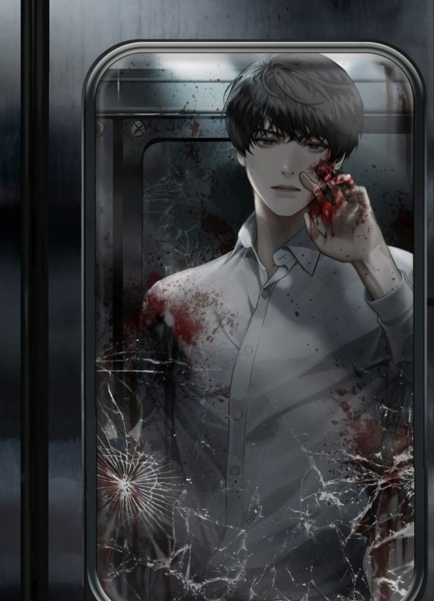
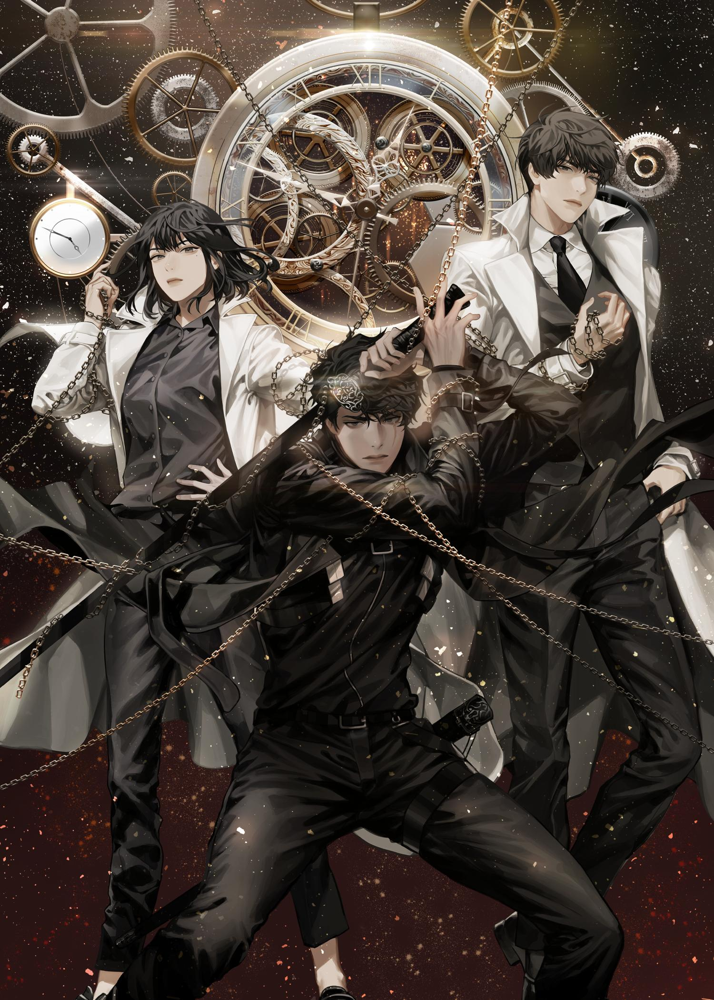
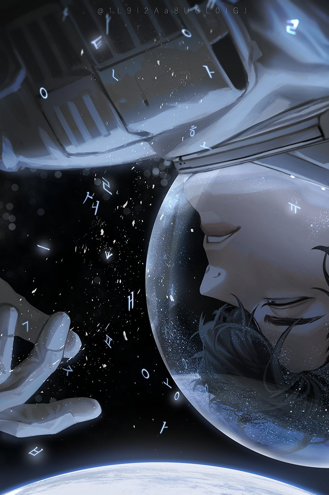

<p align="center">
  
</p>

<h1 align="center">
  <code>&#x2310; The Dokkaebi King's Scenario has arrived. &#x2310;</code>
</h1>

<p align="center">
  <strong>A developer portfolio disguised as a Star Stream scenario.</strong><br/>
  Themed after <em>Omniscient Reader's Viewpoint</em> (&#xC804;&#xC9C0;&#xC801; &#xB3C5;&#xC790; &#xC2DC;&#xC810;) by Sing Shong.
</p>

<p align="center">
  <a href="https://TanakAiko.github.io"></a>
  
  
</p>

---

## The Story

> *"The moment you open this page, you become a constellation watching my story."*

In *Omniscient Reader's Viewpoint*, the world transforms into a novel — people become *incarnations*, skills become *stigmas*, projects become *scenarios*, and unseen watchers called *constellations* observe from the Star Stream.

This portfolio translates that universe into a developer's journey. Every project I've built is a **scenario cleared**. Every technology I've mastered is a **stigma acquired**. The constellations are watching, and the story is still being written.

<p align="center">
  
</p>

---

## What You'll Find

| ORV Concept | Portfolio Equivalent |
|---|---|
| **Incarnation Profile** | Developer status card — class, level, stats, personal skills |
| **Scenarios** | Projects — each with difficulty rating, tech stack, challenges, and rewards |
| **Stigmas** | Technologies — categorized by domain with tier (Mythic/Legendary/Epic/Rare) and mastery level |
| **Constellations** | Interactive star map background with real constellations and watcher messages |
| **Star Stream Ticker** | Live notification bar with constellation reactions |
| **Channels** | Contact links |

---

## Features

- **Interactive Star Map** — Canvas-rendered constellation background with 8 real star patterns (Ursa Major, Orion, Cassiopeia, Leo, Scorpius, Cygnus, Lyra, Gemini), particle effects, and mouse interaction
- **System-style Typewriter** — Sequential message display mimicking ORV's system alerts
- **Constellation Ticker** — Rotating watcher messages in the Star Stream notification bar
- **Character Profile Modal** — Full ORV-style status window with stat bars, skills, and evaluation
- **Page Transitions** — Fade-to-black route transitions like scenario shifts
- **Scroll Animations** — Viewport-triggered reveals using Motion (Framer Motion)
- **Responsive Design** — Fully mobile-adaptive layout

<p align="center">
  
</p>

---

## Tech Stack

| Layer | Technology |
|---|---|
| Framework | React 19 + TypeScript |
| Styling | Tailwind CSS v4 |
| Routing | React Router v7 |
| Animation | Motion (Framer Motion) |
| Canvas | Native Canvas API |
| Build | Vite 8 |
| Fonts | Cinzel, IBM Plex Mono, Outfit (self-hosted) |
| Deploy | GitHub Pages + Actions |

---

## Project Structure

```
src/
  app/          # App shell, routes, page transitions
  components/
    ui/         # Reusable primitives (Typewriter, buttons, badges, tags)
    layout/     # StarMap canvas, Ticker, Footer
    home/       # Hero, StatusCard, ProfileModal, previews
    scenarios/  # Scenario sidebar + detail panel
    stigmas/    # Stigma filter + detail cards
  data/         # All portfolio content (edit here to update)
  pages/        # Route-level page components
  lib/          # Types, constants, design tokens
  styles/       # Tailwind directives, @font-face, CSS variables
```

> To update portfolio content (projects, skills, profile), edit only the files in `src/data/`.

---

## Getting Started

```bash
# Clone the repository
git clone https://github.com/TanakAiko/TanakAiko.github.io.git
cd TanakAiko.github.io

# Install dependencies
npm install

# Start dev server
npm run dev

# Build for production
npm run build
```

---

## Acknowledgements

- **Sing Shong** — Author of *Omniscient Reader's Viewpoint*, the web novel that inspired every design decision in this portfolio
- **All Black Box** ([@1L9l2Aa8UcL0lGJ](https://twitter.com/1L9l2Aa8UcL0lGJ)) — ORV fan art used in this README. All art rights belong to the original artist
- **UMI** (Redice Studio) — Illustrator of the ORV novel covers

---

<p align="center">
  <code>&#x2310; The constellation "The One Who Codes In Silence" is looking at your profile. &#x2310;</code>
</p>

<p align="center">
  <a href="https://TanakAiko.github.io"><strong>&#x25C6; Enter the Star Stream &#x25C6;</strong></a>
</p>
